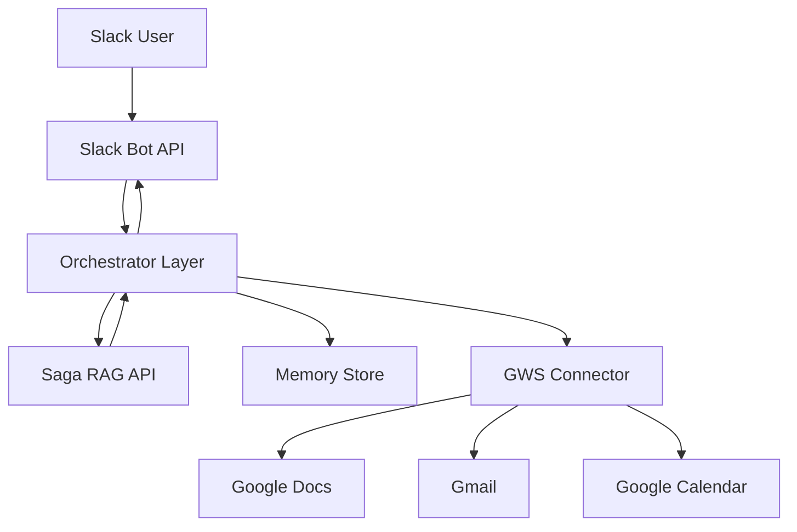

# Saga RAG + Slack Personal Assistant Agent

**Author**: OpenClaw Assistant  
**Date**: 2026-03-24  
**Status**: Draft (Implementation Ready)  
**Primary APIs**: `https://supercent-brain--saga-knowledge-base-search.asia-east1.hosted.app/api-docs`

---

## 1. Overview

이 문서는 Saga RAG API를 지식검색 백엔드로 사용하고, Slack Bot을 인터페이스로 하는 개인/조직형 비서 에이전트의 구현 계획을 기술한다. 핵심 목적은 다음 3가지다.

1. 조직 비전/동향을 실무 액션으로 번역한 응답 제공
2. 근거 기반(citation) 응답 강제
3. Google Workspace(GWS) 연동으로 문서/메일/일정 자동화

---

## 2. Problem Statement

현재 조직 커뮤니케이션은 메시지 전달은 빠르지만, 아래 문제가 반복된다.

- 비전 메시지가 실무자 액션으로 연결되지 않음
- 유사 질문 반복으로 커뮤니케이션 비용 증가
- 답변 출처가 불명확해 재검증 비용 발생
- 문서/메일/캘린더 흐름이 단절되어 실행력이 떨어짐

---

## 3. Goals and Non-Goals

### 3.1 Goals

- Slack 질의에 대해 Saga RAG 기반 응답 + 출처 제공
- 응답 결과를 GWS 문서/메일/캘린더로 전환
- 개인화된 메모리(세션+장기)로 답변 품질 개선
- 운영지표(정확도/지연/출처율) 측정 가능하게 구성
- 전사 구성원이 “왜(비전) → 무엇(트렌드) → 지금 무엇을(액션)”을 한 번에 이해하도록 메시징 구조화

### 3.2 Non-Goals

- 자체 벡터 DB 신규 구축 (초기 단계)
- 멀티워크스페이스 Slack 엔터프라이즈 대응
- 복잡한 승인 워크플로우(다단계 결재)

---

## 4. Persona and Role Model

### 4.1 Primary Persona

- **전사 커뮤니케이션 리더/경영진 지원자**
- 니즈: 비전/동향 전달 + 팀별 실행안 생성 + 동기부여 문구

### 4.2 Secondary Persona

- **팀 리더**: 팀에 맞는 실행 항목이 필요
- **실무자**: "지금 내가 무엇을 해야 하는가"가 필요

### 4.3 Agent Role

- Vision Translator: 경영 메시지 → 실무 언어 변환
- Trend Interpreter: 외부/내부 동향 요약 + 영향도 분석
- Action Planner: 팀별 실행 항목 제안
- Motivation Writer: 발표/공지 문안 생성

### 4.4 Messaging Persona Rules (전사 동기부여 중심)

모든 응답은 아래 4블록 순서를 기본으로 한다.
1. **Vision**: 지금 이 주제가 왜 중요한지 1-2문장
2. **Trend**: 내부/외부 신호 2-3개와 영향도
3. **Action**: 대상별(리더/실무자) 다음 행동 3개 이내
4. **Momentum**: 오늘 바로 시작할 수 있는 첫 행동 1개

금지 패턴:
- 근거 없는 과장/슬로건형 문구
- 역할 불명확한 추상 액션("협업 강화", "열심히")

권장 톤:
- 짧고 명확한 문장
- 심리적 부담을 낮추는 실행 단위(오늘/이번 주)
- 팀별 맥락(목표, KPI, 현재 이슈) 반영

### 4.4 Persona-specific Output Contracts

| Persona | Output Goal | Required Sections | Delivery Channel |
|---------|-------------|-------------------|------------------|
| Leadership | 방향성 정렬 + 우선순위 결정 | Executive Summary, Risks, Next 3 Decisions | Slack channel + Google Doc |
| Team Leads | 팀 실행력 강화 | Team Action Items, KPI Impact, Owner/Deadline | Slack thread + Google Doc |
| ICs | 오늘 할 일 명확화 | What changed, Why it matters, This-week tasks | Slack DM/Channel |
| New Joiners | 맥락 온보딩 | Glossary, Context timeline, FAQ | Google Doc + Slack pinned post |

---

## 5. High-Level Architecture



### 5.1 Components

1. **Slack Bot Gateway**
   - Slash command(`/ask`, `/brief`, `/vision`) 처리
   - 멘션 기반 thread context 유지

2. **Orchestrator (OMG + langchain-bmad style)**
   - Intent 분류
   - Retrieval strategy 선택(fast/deep)
   - Output schema 강제(answer/evidence/sources/confidence/actions)

3. **Saga API Client**
   - `/health`, `/games/{id}/query`, `/rag/search`, `/search/agent/query`, `/rag/context`
   - Retry/timeout/backoff 정책 적용

4. **Memory Layer**
   - 단기: Slack thread 요약
   - 장기: 사용자 선호/결정사항/용어집

5. **GWS Connector**
   - Docs: 브리핑 문서 생성
   - Gmail: 타겟별 요약 발송
   - Calendar: 타운홀/브리핑 일정 생성

---

## 6. API Contract Strategy

## 6.1 Endpoint Selection

| Purpose | Endpoint | Notes |
|--------|----------|------|
| Health check | `GET /health` | startup check |
| Fast Q&A | `POST /games/{id}/query` | 기본 모드 |
| Evidence search | `POST /rag/search` | 출처 강화 |
| Deep reasoning | `POST /search/agent/query` | 고난도 질의 |
| Context enrich | `POST /rag/context` | 맥락 보강 |

### 6.2 Internal Response Schema

```json
{
  "answer": "string",
  "evidence": ["string"],
  "sources": [
    {
      "title": "string",
      "path": "string",
      "chunkId": "string",
      "url": "string"
    }
  ],
  "confidence": "high|medium|low",
  "actions": ["string"],
  "needsApproval": true
}
```

### 6.3 Error Mapping

| Type | Detection | User Message |
|------|-----------|--------------|
| API timeout | > configured timeout | "지금 검색이 지연되고 있어요. 다시 시도할게요." |
| No evidence | sources empty | "근거가 부족해 정확 답변이 어렵습니다." |
| Auth failure | 401/403 | "권한 설정을 확인해주세요." |

---

## 7. Slack Interaction Design

### 7.1 Commands

- `/ask <질문>`: Fast mode
- `/ask-deep <질문>`: Deep mode
- `/vision <주제>`: 비전+실행안 문서 생성
- `/brief <팀/대상>`: 대상별 브리핑 문안
- `/weekly-pulse <대상>`: 주간 비전/트렌드/액션 요약 생성
- `/townhall-pack <주제>`: 발표문 + FAQ + 후속 액션 패키지 생성
- `/townhall-brief <주제>`: 발표 스크립트 + 예상 Q&A + 반대의견 대응 포인트 생성
- `/motivate <팀/기간>`: 동기부여형 실행 메시지(이번주 행동항목 중심)

### 7.2 Thread Policy

- thread 내 질문은 `thread_ts` 기반으로 단기 맥락 유지
- 20턴 이상 누적 시 자동 요약 후 이전 맥락 압축

### 7.3 Approval Policy

- 외부 발송(Gmail/Calendar 생성)은 `needsApproval=true`일 때만 실행

### 7.4 Messaging Workflow (Vision → Trend → Action)

1. **Intent Classify**: 질문을 `vision|trend|action|mixed`로 분류
2. **Audience Select**: 대상 `all-hands|leader|individual-contributor` 지정
3. **Retrieve Pack**: 정책/실적/KPI/시장동향 근거 세트 구성
4. **Draft Generate**: 4블록 템플릿(Vision/Trend/Action/Momentum)으로 초안 생성
5. **Action Quality Gate**:
   - action item은 owner/기한/성과지표 3요소를 포함해야 함
   - 미충족 시 재생성
6. **Human Approval**: 외부 공유 전 승인
7. **Feedback Capture**: Slack 이모지/버튼으로 유용성 수집(👍/👎, "too vague", "too long")
8. **Memory Update**: 반응 점수를 장기 메모리에 반영해 다음 메시지 톤/길이 조정

---

## 8. GWS Integration Plan

### 8.1 Google Docs

- 문서 템플릿 4종:
  1) 전사 비전 브리핑
  2) 팀 실행계획
  3) 발표 스크립트 + 예상 Q&A
  4) 주간 동향→실행 전환 리포트
- 문서 메타데이터 필수 필드:
  - `audience`, `owner`, `effective_date`, `source_links[]`, `confidence`

### 8.2 Gmail

- 리더용/실무용 두 버전 동시 생성
- 제목 규칙: `[Vision Brief][YYYY-MM-DD][Team]`
- 발송 정책:
  - 기본: Draft 생성 후 승인 발송
  - 긴급 모드: 사전 승인된 채널만 자동 발송

### 8.3 Calendar

- 브리핑 일정 자동 초안 생성
- 회의 1시간 전 pre-read 문서 링크 포함

### 8.4 GWS Integration Hardening (실행 중심)

- **Docs**
  - 템플릿 필수 필드: `Vision`, `Signals`, `Team Actions`, `Owner`, `Due Date`, `KPI`
  - 배포 전 문서 권한 기본값: "링크 소유자만 편집, 조직 내 보기"
- **Gmail**
  - 기본 동작은 "Draft only" (자동 발송 비활성)
  - 수신자 세그먼트별 버전 생성: `exec`, `leader`, `all`
  - 제목 A/B 템플릿 지원(오픈율 실험)
- **Calendar**
  - 이벤트 생성 시 목적/사전읽기/결정사항 필드를 본문에 강제
  - 참석자 응답률 + 회의 후 action 생성률 추적
- **Drive/Permissions**
  - 문서 생성 폴더를 팀별로 분리하고 ACL 템플릿화
  - 외부 공유 감지 시 관리자 승인 플래그 활성화
- **Reliability**
  - Google API quota 초과(429) 시 지수 백오프 + 재시도 큐
  - 실패 작업은 DLQ(Dead Letter Queue)에 저장 후 운영자 재처리
- 타운홀 이벤트 템플릿:
  - Agenda, Key talking points, Q&A owner, Follow-up owner

---

## 9. Security and Compliance

- Slack Signing Secret 검증 필수
- Saga API/GWS API keys는 환경변수 + 시크릿 스토어 관리
- 로그에 PII/토큰 마스킹
- 민감 작업은 승인 단계 필수
- 감사 로그(누가/언제/무엇을 실행) 유지

### 9.1 Authentication Model

- Slack -> Orchestrator: Signing secret + bot token 검증
- Orchestrator -> Saga API: service token (server-side only)
- Orchestrator -> GWS: OAuth service account or delegated user auth
- 사용자 단 권한이 필요한 작업은 impersonation 금지, explicit consent required

### 9.2 Data Classification Rules

- Public: 대외 공개 가능한 공지/자료
- Internal: 사내 공유 문서(기본)
- Restricted: 경영/인사/보안 민감 자료
- Restricted 자료는 검색 대상에서 기본 제외(allowlist 방식)

### 9.3 Security Test Cases

- invalid signature 요청 차단
- token leak 패턴 마스킹 검증
- unauthorized channel에서 `/vision` 차단
- citation이 restricted 문서를 노출하지 않는지 검증

---

## 10. Performance Targets

| Metric | Target |
|--------|--------|
| p95 response latency | < 8s |
| citation inclusion rate | >= 95% |
| unsupported question abstain precision | >= 90% |
| failed action rate | < 2% |
| action clarity score (user feedback) | >= 4.2/5 |
| employee usefulness vote ratio (👍) | >= 75% |
| weekly action completion rate | >= 60% |

---

## 11. Observability

- Metrics
  - `rag_query_count`
  - `rag_timeout_count`
  - `response_with_citation_ratio`
  - `approval_required_actions`
- Logs
  - traceId, userId(hash), endpoint, latency, confidence
- Dashboards
  - daily latency percentile
  - citation coverage trend
  - action success/failure
  - audience별 반응(리더/실무자) 및 메시지 길이 대비 유용성
  - 주간 실행완료율(제안 액션 대비 실제 완료)

---

## 12. Risk Matrix

| Risk | Impact | Likelihood | Mitigation |
|------|--------|------------|------------|
| 잘못된 근거 인용 | 높음 | 중 | citation validator + low-confidence abstain |
| 자동 발송 오남용 | 높음 | 중 | 기본 draft 모드 + 승인 게이트 |
| API rate limit | 중 | 중 | retry/backoff + queue + 요약모드 fallback |
| 문서 최신성 지연 | 중 | 높음 | ingestion schedule + freshness flag 표기 |
| Slack 채널 노이즈 | 중 | 중 | role-based response routing + digest mode |

## 13. Rollout Plan

### Phase 1 (Week 1)
- Slack + Saga API fast path 구축
- citation schema 적용
- 내부 샌드박스 채널 테스트

### Phase 2 (Week 2)
- deep mode + memory + GWS 연동
- 팀별 브리핑 자동 문서 생성

### Phase 3 (Week 3)
- 운영 지표 기반 튜닝
- 파일럿 팀 확장

---

## 14. Rollback Plan

- Feature flags
  - `ENABLE_DEEP_MODE`
  - `ENABLE_GWS_ACTIONS`
  - `ENABLE_AUTO_SEND`
- 문제 발생 시
  1) auto action 중단
  2) fast query only 모드 유지
  3) fallback 안내 메시지 활성화

---

## 15. Open Questions

1. 대상 게임/문서 도메인(gameId) 우선순위는 무엇인가?
2. GWS 자동 발송 승인 정책(개인 승인 vs 관리자 승인)은 어떻게 할 것인가?
3. 장기 메모 보존 기간과 삭제 정책은 어떻게 둘 것인가?

---

## 16. Execution Checklist

- [ ] Slack app scopes 확정
- [ ] Saga API auth 방식 확정
- [ ] Response schema validator 구현
- [ ] Citation 없는 응답 차단
- [ ] GWS 문서 템플릿 3종 구축
- [ ] 메시지 4블록 템플릿(Vision/Trend/Action/Momentum) 적용
- [ ] 액션 quality gate(owner/due/KPI) validator 구현
- [ ] Gmail draft-only + 승인 플로우 적용
- [ ] GWS 권한/ACL 정책 검증(외부공유 차단)
- [ ] 베타 채널 운영 시작

---

## 17. References

- Saga API Docs: https://supercent-brain--saga-knowledge-base-search.asia-east1.hosted.app/api-docs
- OpenAPI JSON: https://supercent-brain--saga-knowledge-base-search.asia-east1.hosted.app/openapi.json
- LangChain RAG: https://python.langchain.com/docs/concepts/rag/
- Slack Platform: https://api.slack.com/
- Google Workspace APIs: https://developers.google.com/workspace
